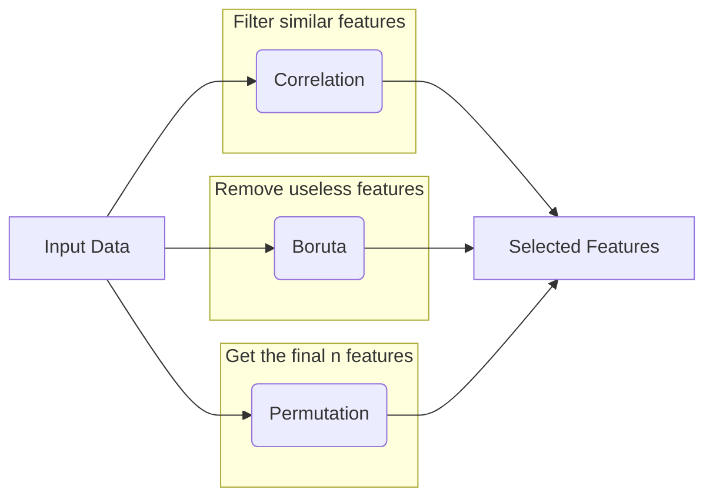

I've been working with Time Series data at work and I got loads of success with using a Random Forest model. This blog post illustrates my key learning points from using this model, namely how random forests work and how I personally have pruned the random forest by reducing the number of features.

<!-- more -->

## How Random Forests Work
The main goal is decorrelation - making hundreds of imperfect but different models to average out errors

To do so it does

- Bagging - each tree sees a different “bootstrap” sample of data → handles **outliers and variance**
- Feature Subsets - at every **single split** within a tree the model is **only allowed to look at a random handful of features** → prevents a dominant feature from making all trees look identical

Each tree has the same importance → for classification the majority rule is done. We can think of each feature in this way:

- Bagging - different textbooks (datasets) to learn from
- Feature Randomness - different chapters (features) to look at

With uncorrelated or random features, errors from overfitting or outlier points are likely to be cancelled out. It is like when multiple geniuses which learn on different types of data come together to make a decision. It sort of builds upon the idea that the wisdom of a herd is stronger than any individual.

## Feature Selection

In order to prune the Random Forest, I first started by taking the top 20 "most important features" which could be obtained via the `feature_importances_` from [`RandomForestClassifier`](https://scikit-learn.org/stable/modules/generated/sklearn.ensemble.RandomForestClassifier.html#randomforestclassifier). However, that's not the best idea.

Feature importance is defined in-terms of impurity → how much chaos a feature removes when the feature is used for splitting. It does not necessarily mean importance. It just means how good it is at splitting features on the training set.

A few important things should be considered

- Taking the top $n$ features might break a model if there are **co-dependent features** If Feature A and Feature B **both** improve the performance of the model, if we remove Feature A, the model might performance might drop drastically
- We might end up with specific but meaningless features that are good at splitting data, but don't make sense - i.e high cardinality features. For instance, when predicting the weather, the date will be a important feature simply because different dates have different weathers, and the model can easily split data.

The following workflow has been found to work for me:

### Correlation
Use correlation to filter out features that are highly similar. A very high correlation is used to prevent accidentally removing useful features. 

### Boruta
Boruta is an all relevant feature selection method which aims to find all features carrying information carrying useful information. This is done by removing any feature that is performs worse or similar to random noise. 

The following resources for explaining how boruta works in detail are very helpful

- [BorutaPy - Daniel Homola](https://danielhomola.com/feature%20selection/phd/borutapy-an-all-relevant-feature-selection-method/)
- [scikit-learn-contrib/boruta_py: Python implementations of the Boruta all-relevant feature selection method.](https://github.com/scikit-learn-contrib/boruta_py)

### Permutation Importance

- Take a feature and randomly shuffle its values across the test data so they no longer match the rows
- If model accuracy crashes, that feature is critical
- Its a method to see which feature the model relies on

Best to not rely on biased `feature_importances_` but rather shuffle the values and check model accuracy, which can be done via [sklearn.inspection.permutation_importance](https://scikit-learn.org/stable/modules/generated/sklearn.inspection.permutation_importance.html#sklearn.inspection.permutation_importance)

Some useful resources I have found on the topic are

- [5.2. Permutation feature importance — scikit-learn 1.8.0 documentation](https://scikit-learn.org/stable/modules/permutation_importance.html)
- [Permutation Importance vs Random Forest Feature Importance (MDI) — scikit-learn 1.8.0 documentation](https://scikit-learn.org/stable/auto_examples/inspection/plot_permutation_importance.html#permutation-importance-vs-random-forest-feature-importance-mdi)

>[!note] 
>In a Random Forest, **more features are not always better.** If you add 50 "junk" features (pure noise) to a model with 5 "signal" features, the model's performance will drop. Why? Because at every split, the algorithm might only be looking at 3 random features. If all 3 are "junk," the tree is forced to make a "junk" split.

